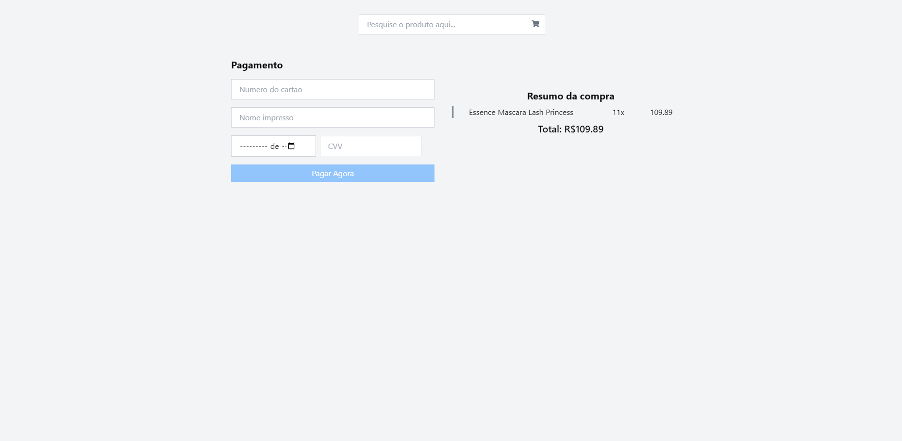

# Ecommerce Barato (desafio Front-End)

## Descrição

Este é um projeto de ecommerce desenvolvido em **React** que consiste em três telas principais:

1. **Tela Inicial**: Apresenta uma lista de produtos e as categorias.

2. **Tela de Oferta**: Apresenta o produto com suas informações e preço.

3. **Tela de Checkout**: Mostra um resumo da compra, permitindo finalizar o pagamento.

O objetivo do projeto é criar uma experiência simples e eficaz de compra online, com funcionalidades como adição ao carrinho e finalização de compra.

### Tela Inicial

### Tela de Oferta

### Checkout

## Tecnologias Utilizadas

- **React**
- **Context API** (para gerenciamento de estado)
- **TailwindCSS** (para estilização)
- **Vite** (para o ambiente de desenvolvimento)
- **LocalStorage** (para persistir os dados no carrinho)
- **Framer Motion** (para animações)

## Funcionalidades

- Visualização de produtos disponíveis
- Consulta dos produtos
- Adição de produto no carrinho
- Atualização de quantidades ao adicionar o mesmo produto no carrinho.
- Adição de quantidade antes de clicar para comprar no carrinho.
- Redirecionamento para a página de checkout com os produtos selecionados.
- Persistência dos dados do carrinho usando o localStorage.
- Validação e submissão do formulário de pagamento.

## Instalação

## Pré-requisitos

- **Node.js** (você pode verificar se está instalado usando node -v)
- **npm ou yarn** para gerenciar dependências.

## Passo a passo

1. Clone o repositório:
   git clone https://github.com/seu-usuario/ecommerce-app.git

2. Navegue até o diretório do projeto:

cd ecommerce-app

3. Instale as dependências:

npm install

# ou

yarn install

4. Execute o projeto:

npm run dev

# ou

yarn dev
O projeto estará disponível em http://localhost:3000.

## Funcionalidades Futuras

- Sistema de login e autenticação.
- Implementação de pagamentos reais (ex. integração com Stripe)

Licença
Este projeto está licenciado sob a MIT License.
